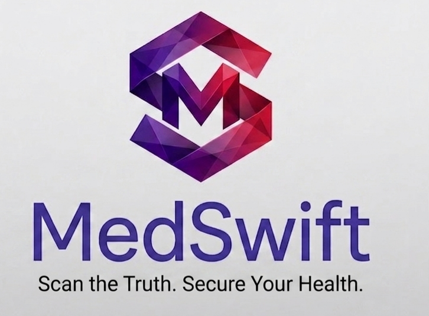
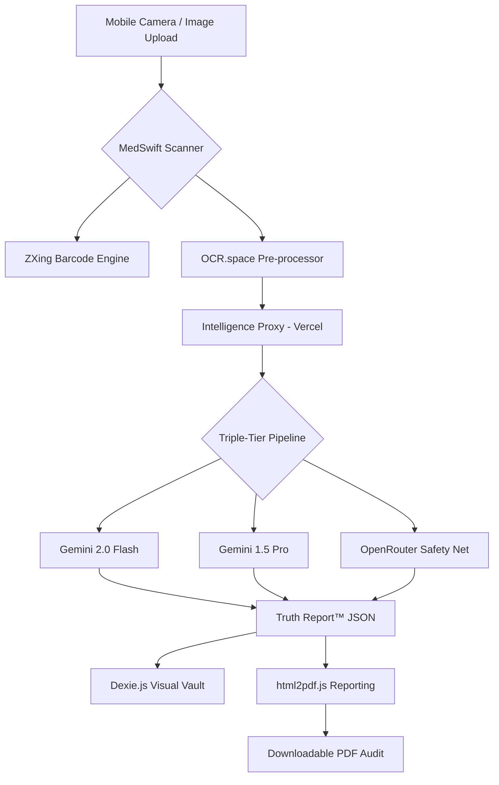

# MedSwift: Scan the Truth. Secure Your Health.

  

---

**MedSwift** is an enterprise-grade **Multimodal Pharmaceutical Intelligence Engine** and Progressive Web App (PWA) designed to eliminate medication uncertainty. Engineered for clinical accuracy, MedSwift transforms the mobile camera into a high-precision auditing tool—verifying drug identity, auditing supply chain origin, and extracting life-saving clinical intelligence in real-time.

---

##  The Intelligence Core: Triple-Tier Resilience

MedSwift utilizes a proprietary **Triple-Tier Resilience Pipeline** to ensure 99.9% precision in pharmaceutical identification, even in low-connectivity or high-noise environments.

1.  **Stage 1: Multi-Modal OCR Pre-processor**: Extracts textual context from packaging using the `OCR.space` engine, feeding high-fidelity strings into the reasoning core.
2.  **Stage 2: Tiered Reasoning Pipeline**:
    -   **Tier 1 (Sentinel)**: `Gemini 2.0 Flash` for ultra-fast, real-time multi-modal analysis.
    -   **Tier 2 (Expert)**: `Gemini 1.5 Pro` for complex reasoning over ambiguous or degraded pharmaceutical labels.
    -   **Tier 3 (Safety Net)**: `OpenRouter` (Claude/Gemini) integration for ultimate architectural redundancy.
3.  **Stage 3: Global Dataset Cross-Referencing**: Every scan is audited against:
    -   **openFDA & EMA**: Regulatory status and origin validation.
    -   **Health Canada DPD**: Therapeutic classification.
    -   **DrugBank & ChEMBL**: Biochemical pathway extraction.
    -   **WHO EML**: Essential medicine verification.

---

##  Key Capabilities

###  MedSwift Vision™
*   **Zero-Shot Identification**: Instant classification of medications from live video or image uploads.
*   **Truth Report™**: Automated generation of professional clinical cards detailing identity, authenticity, and indications.
*   **Clinical Extraction**: Deep analysis of dosage instructions, warnings, and storage requirements directly from the image.

###  Exportable Intelligence
*   **Audit-Ready PDF Reports**: Generate official verification reports via `html2pdf.js` for clinical consultations or supply chain evidence.
*   **Digital Ledger**: Maintains a high-performance local history of all verifications for patient safety tracking.

###  Offline-First Resilience
*   **Visual Vault (Dexie.js)**: Implements a local IndexedDB visual signature store for instant offline verification of previously identified medications.
*   **PWA Architecture**: Full service worker implementation (`sw.js`) ensuring the tool is available anytime, anywhere.

---

##  System Architecture

---

##  Design Philosophy: "Clinical Noir"

MedSwift is built with an **Enterprise Obsidian & Teal** aesthetic, optimized for high-pressure medical environments.
*   **Glassmorphism**: Subtle obsidian overlays for a premium, lightweight feel.
*   **Grid Texture Architecture**: High-fidelity UI layouts inspired by clinical auditing software.
*   **Micro-Animations**: Real-time "Holo-shimmer" and "Scanner Beam" effects provide immediate visual feedback during analysis.

---

##  Technical Stack

*   **Runtime**: Progressive Web App (PWA) with Native ES6 Modules.
*   **Intelligence**: Google Gemini 1.5/2.0 Flash & Pro.
*   **Database**: Dexie.js (IndexedDB) for high-speed client-side caching.
*   **Scanning**: ZXing Multi-format Barcode Library.
*   **Reporting**: html2pdf.js (PDF Generation).
*   **Styling**: Semantic CSS3 (No Frameworks) for maximum performance and design control.
*   **Backend**: Node.js Serverless Functions (Vercel API Proxy).

---

##  Deployment & Configuration

### Prerequisites
*   A Vercel account.
*   Google AI (Gemini) API Key.
*   (Optional) OpenRouter API Key for Tier 3 redundancy.

### Installation
1.  **Clone**: `git clone https://github.com/EGABO-TECH/MedSwift.git`
2.  **Environment Variables**: Set the following in Vercel:
    -   `GEMINI_API_KEY`: Your Google AI key.
    -   `OCR_SPACE_KEY`: Your OCR.space API key.
    -   `OPENROUTER_API_KEY`: (Optional) Your OpenRouter key.
3.  **Deploy**: Push to Vercel for automatic deployment of the API proxy.

---

##  Governance & Compliance
Engineered under the **Renoa Collective** standards for pharmaceutical digital transparency. All AI processing is proxied through a secure serverless backend to ensure client-side key protection and data integrity.

---

### **Developed by EGABO AARON at [RENOA](https://www.linkedin.com/company/renoa-collective/)**
*Advancing Pharmaceutical Integrity through Generative AI and Digital Innovation.*

